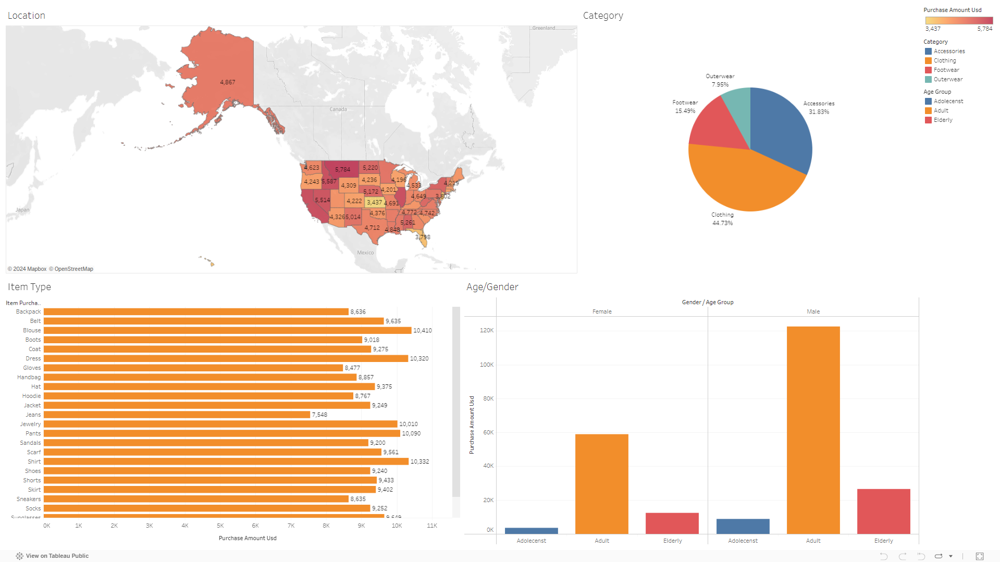

# Customers Shopping Trends Analysis

Data analysis and visualization project to analysis customers shopping trends and creating a dashboard for stakeholders to visualize the customers shopping trends.

## Tools and Technologies

*   Python
*   Pandas
*   Numpy
*   Seaborn
*   Matplotlib
*   Scipy
*   Tableau
## Identification The Problem

***Background***

As the owner of the "R" store which operates in the fashion brand sector which has branches in all states in the United States, you want to know customer shopping trends in all branches in the last year to evaluate and create strategies for the next season.

***SMART***

    1. Specific: Want to increase sales at store "R" in the fall season.

    2. Measurable: Increase sales in the fall season by 10% from the previous season.

    3. Achievable: Based on sales from the previous season, it is expected that sales at "R" stores in the fall season will increase by 10%.

    4. Relevant: Sales at "R" stores can increase by 10% from the previous season.

    5. Time-Bound: Increase "R" store sales in the fall season.

***Problem Statement***

- Increase "R" store sales in the fall season by 10% based on previous season sales.

***Defining the problem:***
- How many customer segments are there according to age and gender
- Where is the state that has the largest number of sales
- What categories of goods are purchased the most?
- When is the season when customers shop the most
- Confidence inverval of total sales
- What is the relationship between payment methods and the amount of goods sold?
- Does the rating affect the number of sales?
- Do discounts and promo codes affect the number of sales?
- Do members have an influence on the number of sales?
## Tableau Visualization

## Conclusion

To increase sales by 10% in the fall season from the previous season, you can do several things, namely:

- Due to the large number of "R" shop customers who are male and the majority are also in the 'Adult' age range, we can increase the number of products that are liked by men in the 'Adult' age range.

- Because "R" stores in the state of Montana get the most sales, the strategies carried out in the state of Montana can be applied to "R" stores in other states and for "R" store branches in the state of Montana itself can continue to strive to get the highest income.

- The category of goods that is most often purchased at "R" stores is clothing and the second is accessories, therefore it can increase the number of goods in the Clothing and accessories categories in "R" stores.

- In the Fall season, purchases at the "R" store get the largest number of purchases, therefore, in order to maintain sales levels, continue to implement existing strategies and continue to increase sales

- Because review ratings are very important for sales at "R" stores, therefore you must always monitor the quality of the goods sold so that goods sold from "R" stores do not get low ratings.

- Even though discounts and promotions have no effect, they are still carried out as promotional media

- Continue to use the membership system to attract more customers